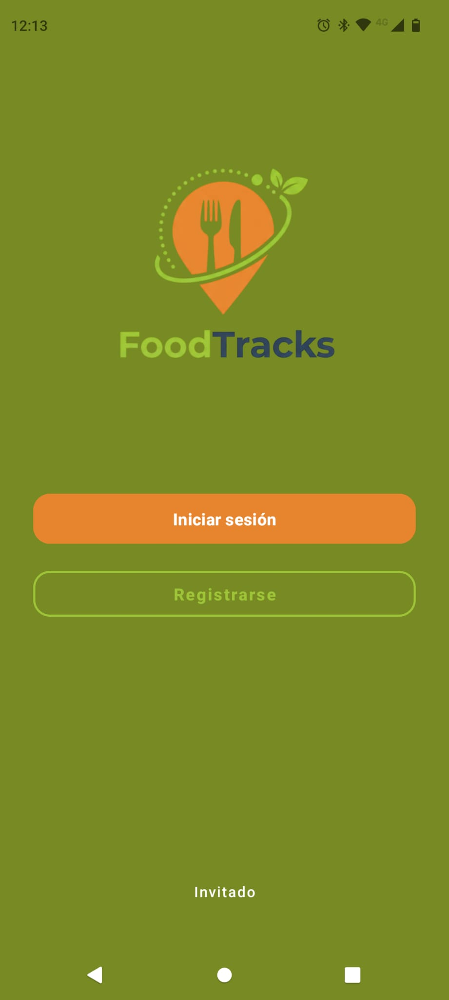
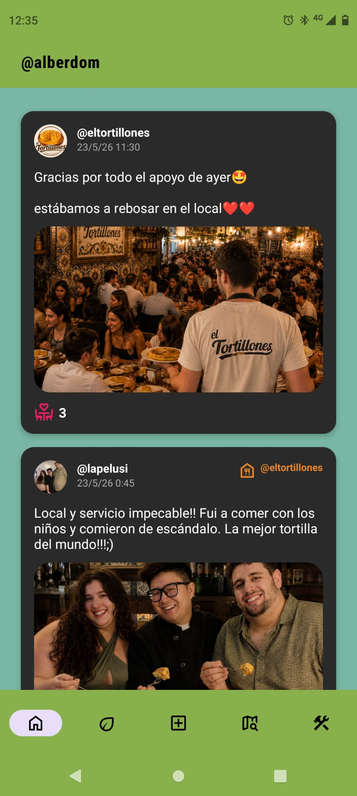
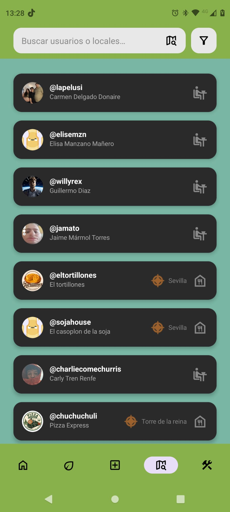
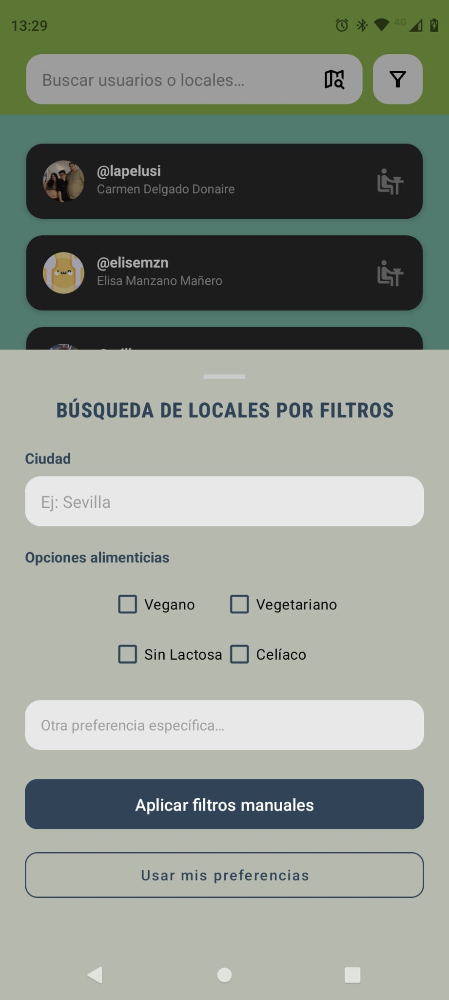

# 🥗 FoodTracks App

**FoodTracks** es una aplicación móvil nativa para Android diseñada para conectar de manera eficiente a personas con limitaciones alimenticias (dietas vegetarianas, veganas, celiaquía u otras intolerancias) con los establecimientos gastronómicos que satisfacen sus necesidades.

| Inicio | Feed Principal | Panel de búsqueda | Filtros inteligentes |
| :---: | :---: | :---: | :---: |
|  |  |  |  |

## 🎯 Propósito del Proyecto
En la actualidad, encontrar opciones gastronómicas seguras para personas con restricciones alimentarias puede ser una tarea frustrante debido a la falta de filtros precisos en plataformas generalistas y a la fragmentación de aplicaciones específicas. **FoodTracks** unifica estas necesidades, permitiendo cruzar múltiples preferencias en una sola búsqueda y aportando una capa de validación de la misma comunidad.

## 👥 Roles de Usuario
La plataforma implementa un sistema de gestión multiperfil con 4 niveles de acceso, cada uno con permisos definidos:

* **👀 Invitado (Guest):** `Modo de solo lectura.`

    Puede visualizar publicaciones, perfiles de otros usuarios y locales, y utilizar el buscador. Sin embargo, no tiene acceso a interacciones sociales (subir contenido, dar likes, valorar) hasta que se registre.

* **🧑‍🤝‍🧑 Cliente:** `Usuario estándar de la comunidad.`
    * Crear, subir y visualizar **publicaciones**.
    * **Ver y editar** su propia información de perfil.
    * Visitar el perfil de otros usuarios y locales.
    * Buscar usuarios, locales y utilizar los filtros avanzados para encontrar establecimientos.
    * **Valorar y puntuar** locales gastronómicos.
    * **Eliminar** su propia cuenta.
* **🏪 Local (Establecimiento):** `Perfil orientado a los negocios hosteleros.`
    * Posee las mismas capacidades de interacción social que el cliente, **excepto la opción de valorar a otros locales**.
    * **Ubicación precisa:** Su perfil renderiza un mapa interactivo exacto con la ubicación geográfica del establecimiento.
    * **Dashboard Estadístico:** Acceso exclusivo a un panel de control privado con métricas sobre visitas a su perfil, puntuación media, número total de valoraciones recibidas y más datos interesantes.
* **🛡️ Administrador (Admin):** `Encargado de la moderación de contenido y mantenimiento de la comunidad.`
    * Posee todas las funciones básicas de navegación e interacción de un cliente.
    * Capacidad para ver y **eliminar cualquier publicación** de la plataforma (exceptuando las creadas por otros administradores).
    * Capacidad para ver y **eliminar de forma permanente cualquier perfil** de usuario o local (exceptuando a otros administradores).
    * **Panel de Administrador:** Interfaz dedicada que muestra un historial de auditoría con todos los registros de borrado llevados a cabo en la plataforma. 
    * *Seguridad y Auditoría:* Al ejecutar el borrado de una publicación o cuenta, el sistema le exige introducir obligatoriamente un **motivo de eliminación**, el cual queda registrado en la base de datos.

## 🛠️ Tecnologías Utilizadas
* **Lenguaje y Entorno:** Java (JDK 21), Android Studio.
* **Base de datos y Autenticación:** Firebase Firestore (Base de datos NoSQL en tiempo real) y Firebase Authentication.
* **Consumo de APIs:** **Retrofit** (para la gestión de peticiones REST hacia servicios externos).
* **Mapas y Geolocalización:** osmdroid (mapas interactivos open-source) y Geocoder.
* **Gestión Multimedia:** ImageKit API (almacenamiento en la nube) y Glide (renderizado de imágenes).
* **Librerías Adicionales:** Lombok (reducción de código repetitivo) y Spotless (formateo y limpieza de código).

## 🏗️ Arquitectura del Sistema
El proyecto se ha desarrollado siguiendo una **arquitectura en capas**, respetando el Principio de Responsabilidad Única para separar la lógica de negocio, el acceso a datos y la interfaz gráfica:

* **Capa de Modelos (Models):** Entidades básicas que definen la estructura de datos, integradas con las anotaciones de Firebase y Lombok.
* **Capa de Repositorios (Repositories):** Módulos encargados de la persistencia y operaciones CRUD directas con Firebase Firestore y la API de ImageKit.
* **Capa de Servicios (Services):** Contiene la lógica de negocio compleja (ej. recálculo automático de medias o borrado de datos en cascada). Son instanciados a través de un patrón `ServiceFactory`.
* **Capa de Interfaz de Usuario (UI):** Implementación de una arquitectura *Single-Activity* basada en el uso de **Fragments**. Este diseño garantiza transiciones instantáneas, evita la recarga de vistas pesadas y ofrece una experiencia de usuario mucho más fluida.

### 📂 Estructura del Proyecto

```text
com.foodtracks.app
├── activities/             # Activities principales y controladores por rol
│   ├── admin/         
│   ├── cliente/
│   └── local/            
├── adapters/               # Adaptadores para la gestión de listas (RecyclerView)
├── api/                    # Configuración de clientes API externos
│   └── imagekit/           # Configuración de Retrofit para ImageKit
├── fragments/
│   ├── admin/
│   ├── cliente/
│   └── local/
├── models/                 # Entidades de datos
├── repositories/           # Capa de acceso a datos
│   └── interfaces/         # Contratos de acceso a datos (Patrón Repository)
├── services/               # Lógica de negocio (Capa de servicios)
│   ├── exceptions/         # Excepciones personalizadas del dominio
│   └── interfaces/         # Contratos de servicios (Patrón Service)
└── utils/                  # Clases de utilidad (String, Fecha, Geolocalización)
```

## 📚 Documentación Técnica y Configuración Local

### 1. Documentación del Código (Javadoc)
La documentación técnica del código fuente (Javadoc) ha sido generada automáticamente para detallar la estructura de clases, métodos, encapsulamiento y lógica de negocio implementada en la aplicación.

#### Cómo visualizarla:
1. Navega mediante el explorador de archivos de tu sistema a la carpeta `foodtracksApp/app/doc`.
2. Busca el archivo raíz denominado **`index.html`**.
3. Haz doble clic sobre él para abrirlo en cualquier navegador web (Chrome, Firefox, Edge, etc.) y navegar por la documentación interactiva.

---

### 2. Guía de Compilación y Ejecución en Local
Si deseas clonar el proyecto y ejecutarlo en tu propio entorno de desarrollo local, debes seguir los siguientes pasos:

#### Paso 2.1: Clonar el repositorio
Abre tu terminal y clona el proyecto en tu máquina local:
```bash
git clone https://github.com/robertskrr/FoodTracks-App.git
```

#### Paso 2.2: Configurar el JDK a la versión 21
La lógica del backend y los scripts de Gradle requieren Java 21 para compilar las dependencias.
1. Abre **Android Studio** e importa el proyecto desde la carpeta raíz `foodTracksApp`.
2. Ve al menú superior: `File` > `Settings`.
3. Navega a `Build, Execution, Deployment` > `Build Tools` > `Gradle`.
4. En el apartado **Gradle JDK**, asegúrate de desplegar y seleccionar **Java 21**.

#### Paso 2.3: Crear y vincular la base de datos de Firebase
Por motivos de seguridad, las credenciales, reglas y tokens de conexión con el backend remoto no se suben al repositorio. Debes vincular tu propio entorno espejo:
1. Accede a la [Consola de Firebase](https://console.firebase.google.com/) y crea un nuevo proyecto para tu aplicación.
2. Dentro del panel de Firebase, habilita explícitamente los siguientes servicios esenciales:
   * **Authentication:** Activa el método de inicio de sesión mediante *Correo electrónico y contraseña*.
   * **Firestore Database:** Crea la base de datos en la nube.
3. Añade una nueva aplicación Android dentro del proyecto de Firebase e introduce el nombre del paquete del proyecto: `com.foodtracks.app`.
4. Descarga el archivo de configuración generado llamado **`google-services.json`**.
5. Mueve o pega dicho archivo dentro de la carpeta local `foodtracksApp/app/` de tu proyecto.

#### Paso 2.4: Vincular las claves de ImageKit en `local.properties`
La aplicación utiliza la API de ImageKit para el almacenamiento eficiente y la carga rápida de las imágenes de las publicaciones y los perfiles. El archivo `build.gradle` lee estas credenciales en tiempo de compilación, por lo que es obligatorio mapearlas localmente:
1. En la raíz absoluta del proyecto, localiza el archivo llamado **`local.properties`** (si no existe, créalo como un archivo de texto plano).
2. Añade las siguientes líneas al final del archivo, reemplazando los valores por tus credenciales de la consola de administración de ImageKit:

```properties
IMAGEKIT_URL_ENDPOINT="[https://ik.imagekit.io/tu_codigo_de_usuario](https://ik.imagekit.io/tu_codigo_de_usuario)"
IMAGEKIT_PUBLIC_KEY="public_tu_clave_publica_aqui="
IMAGEKIT_PRIVATE_KEY="private_tu_clave_privada_aqui="
```

> 🔐 **Nota de seguridad:** El archivo `local.properties` está incluido en el filtro de exclusión de nuestro `.gitignore`. Esto garantiza que tus claves privadas se mantendrán seguras en local y nunca se expondrán públicamente al subir cambios a GitHub.

---

### 3. Sincronización y Despliegue final
Una vez completados los pasos anteriores:
1. Haz clic en el botón **"Sync Now"** (el icono del elefante en la barra superior de Android Studio) para que Gradle descargue las librerías necesarias e inyecte los campos del `BuildConfig`.
2. Conecta tu dispositivo físico mediante depuración USB o inicia un emulador de Android.
3. Pulsa el botón **Run** (el icono de "Play" verde) para compilar, instalar y ejecutar la aplicación FoodTracks libre de errores.

## 🔗 Enlaces
* **Repositorio en GitHub:** [FoodTracks-App](https://github.com/robertskrr/FoodTracks-App)
